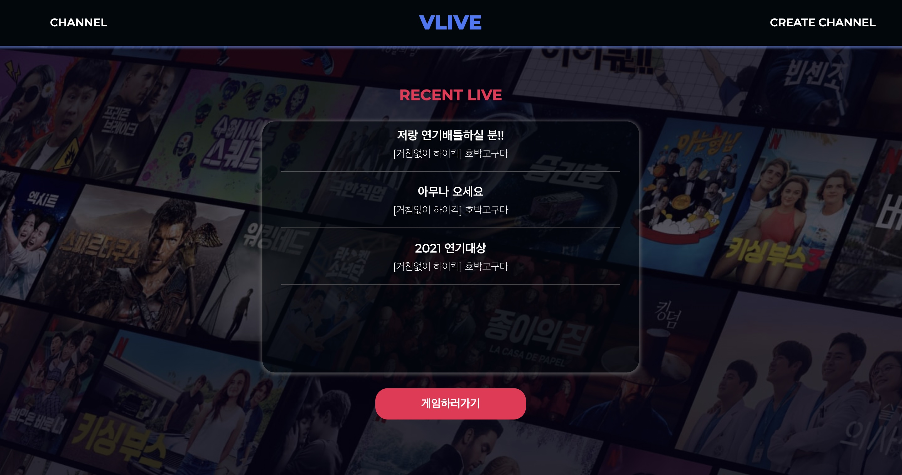
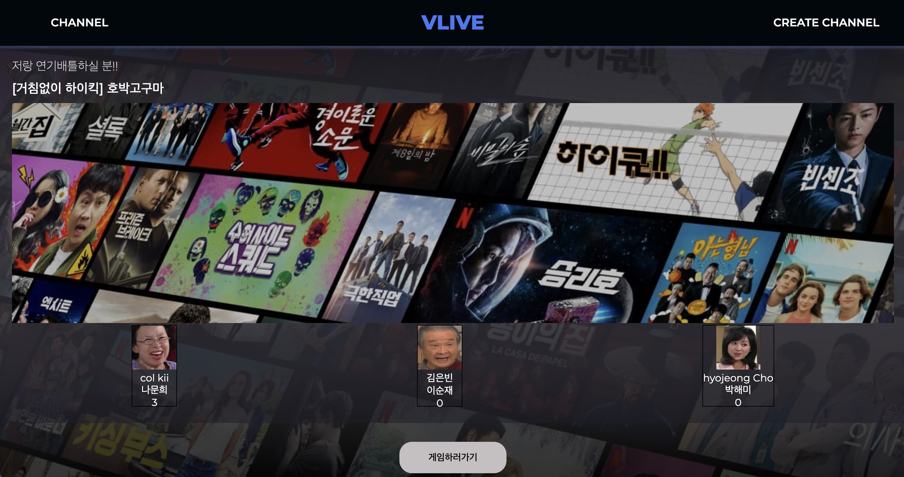
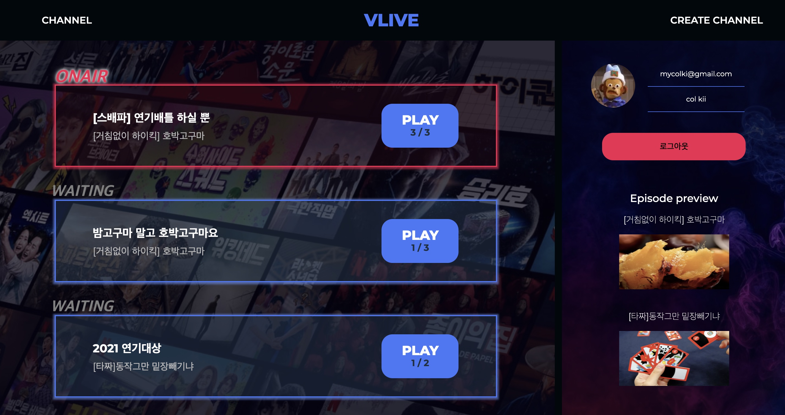
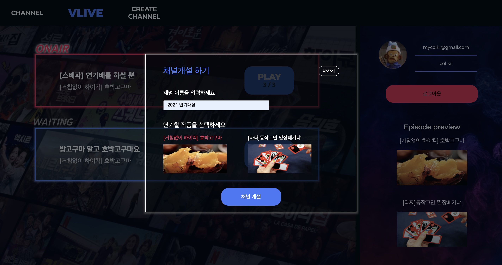
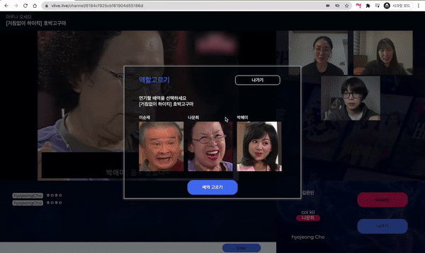
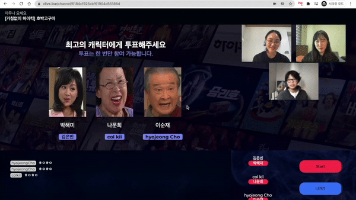

# **🎙 V-LIVE**


**V-LIVE** 는 드라마나 영화의 한 장면을 **실시간 스트리밍**으로 보면서 **직접 연기하면서 배우가 되어 보는 경험**을 사람들과 공유할 수 있는 라이브 게임입니다.

#### 🔗 **[V-LIVE 시연 영상 (소리가 나옵니다 🔊) ](https://awwdwd.s3.ap-northeast-2.amazonaws.com/vlive_%E1%84%89%E1%85%B5%E1%84%8B%E1%85%A7%E1%86%AB+%E1%84%8B%E1%85%A7%E1%86%BC%E1%84%89%E1%85%A1%E1%86%BC.mp4)**

#### 🔗 **[DEMO LINK](https://www.vlive.live/)**

<br>
<br>

# **𝌞 CONTENTS**

- [🎙 V-LIVE](#-V-LIVE)
- [🎤 INTRODUCTION](#-INTRODUCTION)
- [📸 FEATURES](#-FEATURES)
- [🕋 STACK](#-STACK)
- [🕹 USAGE](#-USAGE)
- [🎞 DEPLOY](#-DEPLOY)
- [🎥 PROJECT LOG](#-PROJECT-LOG)

<br>
<br>

# **🎤 INTRODUCTION**

### **프로젝트 기간**

2021.08.30 ~ 2021.09.18 : 3주

- 아이디어 기획, 목업작성, 애자일 스프린트 플랜 : 1주
- 개발 진행, 배포, 테스트 : 2주

### **프로젝트 멤버**

🐞 [버그잡기 달인 **김은빈**](https://github.com/stitchy11)<br>
🤹 [디테일의 달인 **양하윤**](https://github.com/mycolki)<br>
😃 [화이팅의 달인 **조효정**](https://github.com/julian-jeong)

### **프로젝트 동기**

흔히 짤이라고 일컬어지는 **드라마나 영화의 한 장면**이 온라인에서 공유되고, <br>많은 사람들이 이를 따라하며 즐거워하는 것에서 영감을 얻어 **V-LIVE** 를 제작하게 되었습니다.

### **프로젝트 프로세스**

- 아이디어 기획
- 기술 스택 검토
- [**Figma를 이용한 Mockup**](https://www.figma.com/file/JoxQgsA29zX7TaaEXHeIkC/Dubbing-Game?node-id=0%3A1)설계
- 데이터베이스 Schema설계
- **Agile Sprint** 기반의 태스크 매니지먼트
- Git Repo를 Frontend와 Backend 로 **각각 구분**하여 독립적으로 관리

### **Git Work Flow**

- branch: master & feature branches
- 기능별로 feature branch를 생성하고 코드 작성
- master 브랜치로 병합 (rebase 전략)

<br>
<br>

# **📸 FEATURES**

- Firebase 소셜 로그인 및 Json Web Token을 이용한 사용자 인증
- MongoDB Atlas를 이용한 채널정보 및 사용자 정보 관리
- WebRTC, Peer를 이용한 실시간 화상 채팅 기능
- Socket.io을 이용한 데이터베이스 실시간 업데이트
  - 실시간 채팅 기능
  - 채널 개설, 입장/퇴장, 게임 진행 여부 채널 목록에 반영
  - 게임 준비 상태 및 드라마 역할 선택 반영
- 투표하기 및 투표 결과 공유 기능
- 에피소드 프리뷰 재생 기능
- 채널 히스토리 저장

<br>
<br>

> **랜딩 화면 ~ 히스토리 ~ 채널 목록 ~ 채널 생성**

<div>




</div>

<br>

> **역할 선택**



<br>

> **실시간 더빙 연기**


<br>

> **연기 투표**



<br>
<br>

<details>
  <summary><b>게임 화면 별 상세 기능 보기</b></summary>

<br>

**Landing Page: 최근 히스토리**

- 종료된 채널의 드라마 에피소드와 참여했던 사용자들의 투표결과를 확인할 수 있습니다.
- 초기 랜딩 화면에 목록으로 보여지며, 로그인하지 않더라도 누구든지 히스토리를 열람할 수 있습니다.

**Main Page : 채널 목록/ 대기실**

- 로그인
  - Firebase 기반의 소셜 로그인
  - JSON WebToken을 이용한 인증
  - 인증이 된 사용자에 한하여 채널을 개설하고 채널에 입장하여 게임에 참여할 수 있습니다.
- 프리뷰
  - 에피소드를 미리보기 할 수 있는 기능으로,
    채널 입장 전, 충분히 혼자 연습해볼 수 있는 기회를 제공합니다.
- 채널개설
  - 채널의 이름을 작성하고, 드라마 에피소드를 선택하여 채널을 개설할 수 있습니다.
  - 선택한 에피소드의 배우들의 역할과 인원이 정해진 채널이 개설되고, 호스트는 첫 번째 참여자로 채널에 입장하게 됩니다.
- 채널 입장
  - 다른 사용자들이 실시간으로 개설하는 채널을 볼 수 있고, 자유롭게 채널에 입장할 수 있습니다.
  - 실시간으로 채널에 입장 및 퇴장하는 유저들의 숫자를 확인할 수 있습니다.
  - Onair/Waiting 등의 채널상태를 보고 진행중인 채널인지, 대기중인 채널인지 미리 확인할 수 있습니다.

**Channel Page: 실시간 라이브**

- 배역선택 / 준비
  - 채널에 입장하고 READY 버튼을 눌러서 원하는 배역을 선택할 수 있습니다.
  - 유저의 닉네임 옆에, 선택한 배역이 표시됩니다.
  - 이미 다른 사용자가 선택한 배역은 중복으로 선택할 수 없습니다.
  - 모든 유저가 배역을 선택했다면, 호스트는 START버튼을 눌러서 라이브를 시작할 수 있습니다.
- 채팅
  - 사용자들은 채널 내에서 자유롭게 채팅으로 소통할 수 있습니다.
  - 카메라/마이크를 통해 화면을 보면서 화상/음성으로 소통할 수 있습니다.
- 라이브
  - 실시간 스트리밍서비스이기 때문에 마치 한 자리에 있는 것처럼, 모든 사용자가 동시에 같은 비디오와 오디오를 공유할 수 있습니다.
  - 에피소드 영상에 나오는 본인이 맡은 배우의 대사를 따라하면서 혼신의 연기를 합니다.
- 투표
  - 영상이 끝나고, 최고의 명연기를 보여준 배우에게 투표합니다.
  - 투표가 종료되면 배우별로 각 집계된 표수를 보여주고 가장 많은 표를 받은 배우를 보여줍니다.
  - 투표결과는 히스토리에 저장되어 랜딩화면의 최근히스토리에 기록됩니다.
  </details>

<br>
<br>

# **🕋 STACK**

### **Frontend**

- JavaScript ES2015+
- Next.js
- SWR
- Simple-Peer
- Socket.io & Socket.io Client
- Firebase
- Emotion
- Jest
- React Testing Library
- ESLint

### **Backend**

- JavaScript ES2015+
- Node.js
- Express
- MongoDB & Mongoose
- Json Web Token Authentication
- Joi
- Chai
- Mocha
- Supertest for unit-test
- ESLint

<br>
<br>

# **🕹 USAGE**

### **Requirements**

- 최신 버전의 Chrome Browser 사용을 권장합니다.
- 마이크 / 카메라 접근 권한 승인이 필요합니다.
- Local에서 실행하기 위해 사전 준비가 필요합니다.
  - [Firebase API Key](https://firebase.google.com/?hl=ko)
  - [MongoDB](https://www.mongodb.com/)

### **Installation**

Root 디렉토리에 `.env` 파일을 생성하고, 다음 환경변수를 입력하고 실행합니다.

- Frontend

  ```jsx
  NEXT_PUBLIC_FIREBASE_API_KEY>
  NEXT_PUBLIC_FIREBASE_AUTH_DOMAIN>
  NEXT_PUBLIC_FIREBASE_PROJECT_ID>
  NEXT_PUBLIC_FIREBASE_STORAGEBUCKET>
  NEXT_PUBLIC_FIREBASE_MESSAGING_SENDER_ID>
  NEXT_PUBLIC_FIREBASE_APP_ID>
  NEXT_PUBLIC_FIREBASE_DATABASE_URL>
  NEXT_PUBLIC_API_URL=https://api.vlive.live
  ```

  ```jsx
  $ git clone https://github.com/voicelive/VLive_frontend.git
  $ cd VLive_frontend
  $ npm install
  $ npm start
  ```

- Backend

  ```jsx
  MONGO_DB_URL>
  TOKEN_SECRET_KEY>
  ```

  ```jsx
  $ git clone https://github.com/voicelive/VLive_backend.git
  $ cd VLive_backend
  $ npm install
  $ npm start
  ```

<br>
<br>

# **🎞 DEPLOY**

- AWS Elastic Beanstalk를 사용하여 애플리케이션 배포 및 관리
- Pipeline을 이용한 배포 자동화 구현

- **Frontend** : https://www.vlive.live

- **Backend** : https://api.vlive.live

<br>
<br>

# **🎥 PROJECT LOG**

### **팀 프로젝트 협업**

게임의 흐름 특성상, 대부분의 기능들이 소켓 이벤트 기반이라 각 기능 간의 연속성과 의존성이 높았습니다. 기능 테스트를 할 때도 연관된 다른 기능들에 영향을 많이 받는 구조였기 때문에 각 기능들의 관계를 정립하는 시간을 많이 가졌습니다.

그리고 팀원 모두 협업이 처음이었기 때문에 Github를 통한 Git flow 를 따라가는 데에 난항이 있었습니다. 프로젝트 초반, 부족한 코드리뷰 후에 에러 처리 안된 상태의 코드가 master 에 merge 가 되기도 하고, rebase 처리가 완벽히 되지 않아서 에러가 빈번하게 일어나기도 했습니다.
이를 해결하기 위해 merge 전 오프라인 코드 리뷰 시스템을 도입하면서 활발한 커뮤니케이션이 이루어졌고, 이 때 깃 브랜치 전략에 대한 방향성도 통일되어 프로젝트를 안정적으로 진행할 수 있었습니다.

결과적으로 소통 부재로 인한 팀원간의 갈등은 없었지만, 초기에 시간을 효율적으로 사용하지 못해 후반부에 육체적 피로감이 컸던 부분은 많은 아쉬움으로 남습니다.

### **프로젝트 배포 시행착오**

이전에 경험했던 React 와는 다르게 Next 와 서버 단에서의 소켓 연결이 정상적으로 진행되지 않아 Next.js 내에서 커스텀서버를 만들어 소켓을 연결하는 방식으로 진행하게 되었습니다. 하지만 Vercel에서는 커스텀 서버의 배포는 지원하지 않는 것을 배포 단계에서 알게 되었고 다음 솔루션으로 시도했습니다.

1. Next.js 의 page 폴더에 API 엔드 포인트를 추가하고<br>기존 커스텀 서버의 socket 로직을 옮기는 방법
2. AWS 를 이용해 배포하는 방법

첫 번째 방법으로 시도하고 재배포했으나, 기대와 달리 새로 작성한 API 요청이 전달되지 않았습니다. 코드를 옮기는 데에 실수가 있거나 로직적인 결함은 없었지만 추측에 기대어 실행했던 방법이었기 때문에 보다 확실한 두 번째 방법으로 진행했고 성공적으로 배포가 되었습니다. 다만 AWS 로 배포하는 경우에는 Vercel 에서 build 과정을 생략해주는 기능이 지원되지 않기 때문에, 매번 push 를 할 때마다 build 를 다시 해야 하는 번거로움이 생겼습니다. 배포 시행착오를 거듭하면서 사전 조사의 중요성에 대해 강한 교훈을 얻게 되었습니다.

### **Socket 이벤트 성능 해결**

게임 진행 특성상 소켓 이벤트가 2개 이상의 컴포넌트에서 다중으로 연결되어 있는 경우가 많아서 잦은 테스트와 충돌을 보완하는 데에 생각보다 많은 시간이 걸렸습니다. 사용자의 채널 입장/퇴장을 관리하는 컴포넌트에서 useSWR 이 반환한 mutate 를 이용해 소켓 이벤트로 받은 유저정보를 DB 에 업데이트하는 과정에서 서버 단으로 불필요한 HTTP 요청이 과도하게 들어가는 등, 결과적으로 실시간성이 보장되지 않고 렌더링이 늦어지는 문제가 생겼습니다. 확인 결과 hook 의 리턴값으로 활용하던 socketClient 내부에서 이벤트리스너가 제거되지 않아 생긴 누수 문제임을 파악하고 클린업함수를 추가하는 방법으로 문제를 해결할 수 있었습니다

### **WebRTC & Socket Event**

사용자가 채널에 입장했을 때 peer 연결 및 비디오 스트리밍을 위해 `Channel` 컴포넌트에서 입장한 유저의 정보를 채널의 타 사용자들에게 전달하는 소켓 이벤트를 발생시켰으나, 하위의 `Video` 컴포넌트에 있던 이벤트리스너가 정상적으로 해당 이벤트를 수신하지 못해 peer 연결과 스트리밍이 잘 이루어지지 않았습니다. 하위 `Video` 컴포넌트의 useEffect 내부의 stream 을 생성하는 비동기함수가 실행된 다음에 이벤트리스너가 생성되도록 작성되어 있었기 때문에,
상위 컴포넌트에서 이벤트를 보내는 함수가 먼저 실행되었고, 해당이벤트를 수신할 리스너의 부재가 원인이었습니다.

실시간으로 빠르게 이루어지는 소켓의 특성을 이해하고 순서가 보장되도록 `Channel` 컴포넌트에서 stream 및 소켓이벤트 관련 로직을 동시에 컨트롤하는 방향으로 문제를 해결할 수 있었습니다.
비동기작업과 소켓 이벤트의 실시간성을 함께 고려하지 못한 부분에서 비롯된 이슈었지만, 결과적으로 컴포넌트의 단방향성을 상기하여 상위 컴포넌트에서는 소켓과 peer 를 연결하는 비즈니스로직을 담당하고 하위 컴포넌트에서는 생성된 stream 을 렌더링만 하도록 관심사를 분리할 수 있었습니다.
